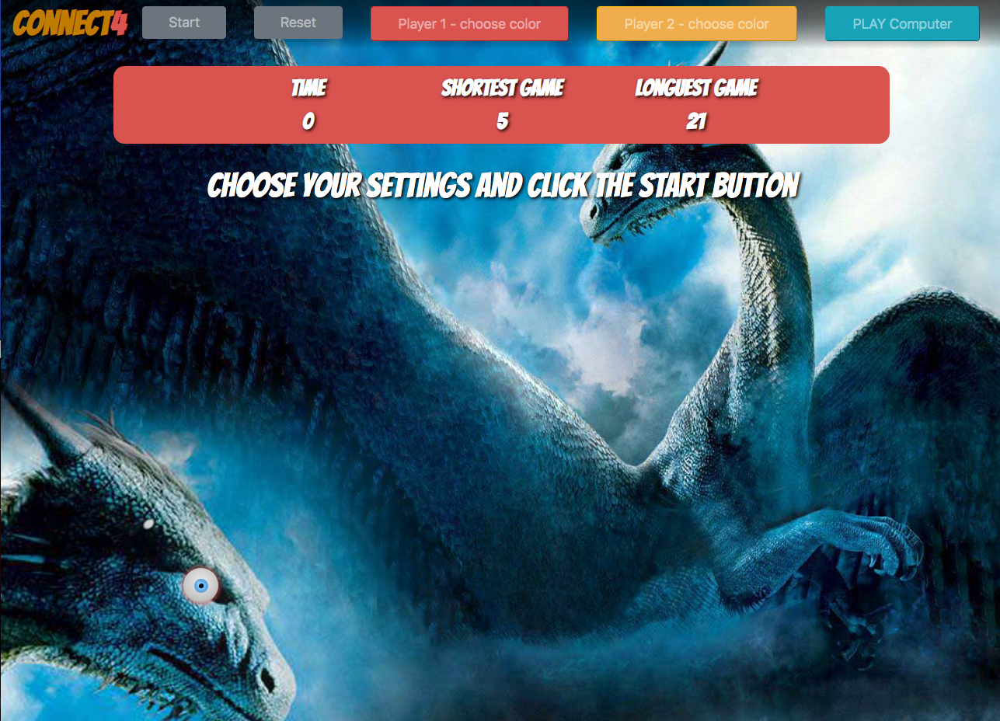
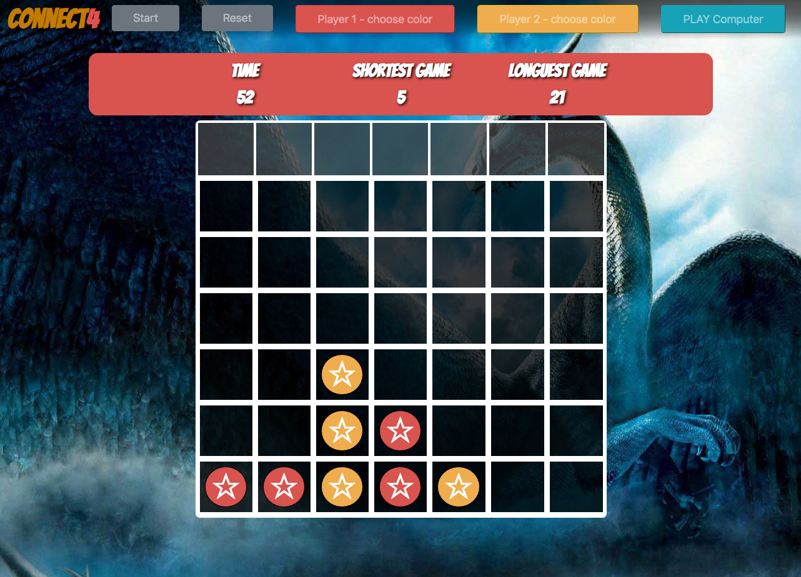
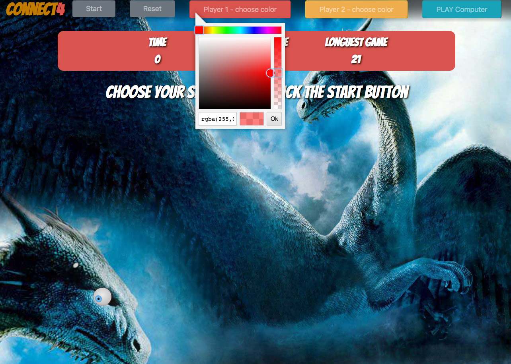

# Connect-Four Refactoring OO: UNIT 12 Report
by: Etienne Deneault

App URL: https://edeneault.github.io/Connect-Four/
GitHub Repository: https://github.com/edeneault/Connect-Four/tree/main

## Features

* Game Start and Reset Buttons.

* ColorPicker to choose custom piece color.

* Computer Player Game Instance for solo play.

* Scoreboad background color updated to represent players turn.

* Dynamic DOM messaging.

* Mark-up includes Nav Bar with the buttons and persisted value scoreboard. Nav Bar is collapsable.

* Token drop is CSS Animated- *vert-slide-in* and *star-spin*.

* Local Storage is uses to persist - shortest and longest game values in the scoreboard.

* 3D CSS EyeBall integrated into the background images for "large" viewports (above width: 1320px). @Media inquiries included to remove if the user viewport is to small to support "positioning".

* Responsive Behavior - adapts to smaller viewports with the use of BootStrap4 classes and CSS @media inquiries.

## Know Issues and Furthey Study 

* Alignment of falling tokens is off on smaller screens.  Needs furthey study to fix.
* Adding difficulty settings by dynamically adjusting height and width values using user input.
* Adding difficulty levels for Computer Play i.e. computer checking "close to winning" game states to determine where to place piece.

* The code would benefit from utilizing more economical syntax/stucture code i.e. higher order functions and ES 2015 functions.
* As mentionened, in the project hand-out, checkForWin() could be more efficient.  Using a set of *array-like collections* for winning states and "close to winning" states in combination with *some* may enhance program functionality. 

## Process && Learnings

* The process that I followed was the following:
    * Game design reflection: functions needed and game logic.
    * OO Unit 12 - Assignment step-by-step to build basic app functionality and mark-up using Object-Oriented programming.
    * Refactoring of connect4 app from previous unit.
    * Addition of "further study" features.
    * Polishing of html and css
    * Commenting and Documentation

* Programing with an objet-oriented approach practical experience gained.

* Game-Flow logic experience gained.

* Experimented with 3d capabilities of css and got some practice with css positioning. (and it's limitations when designing for responsiveness)

## Game Renderings

  
  
  

## Technologies && Third Party Libraries && Fonts

* HTML, CSS, JavaScript

* Bootstrap4: https://maxcdn.bootstrapcdn.com/bootstrap/4.0.0/css/bootstrap.min.css
* Google Font APi: https://fonts.googleapis.com/css?family=Bangers
* Color Picker Plug-In https://vanilla-picker.js.org/gen/Picker.html#Picker__anchor

## Sources && References

* Code Base provided by SpringBoard - Connect-four (Unit 11)

* Eye Ball css was adapted from the code in the following article: https://cssanimation.rocks/spheres/

* Background Image: https://wallpaperaccess.com/full/199962.jpg  (non-monitized use is explicitly stated as permitted)

* Color Picker: https://vanilla-picker.js.org/gen/Picker.html#Picker__anchor